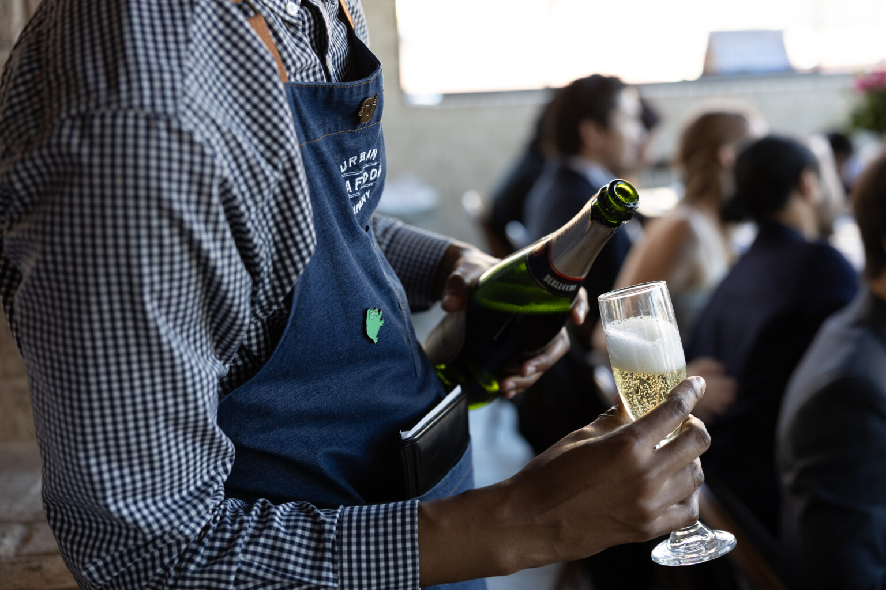
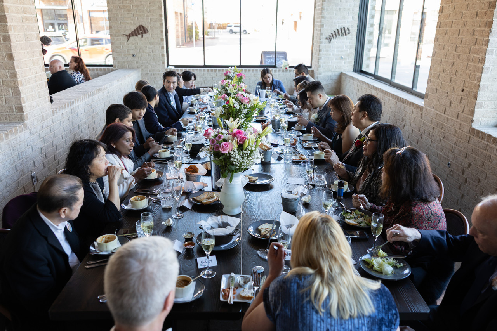
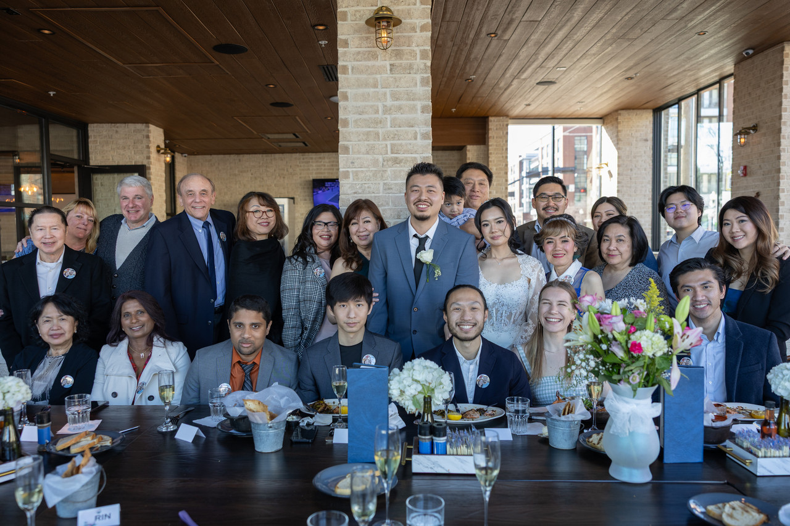
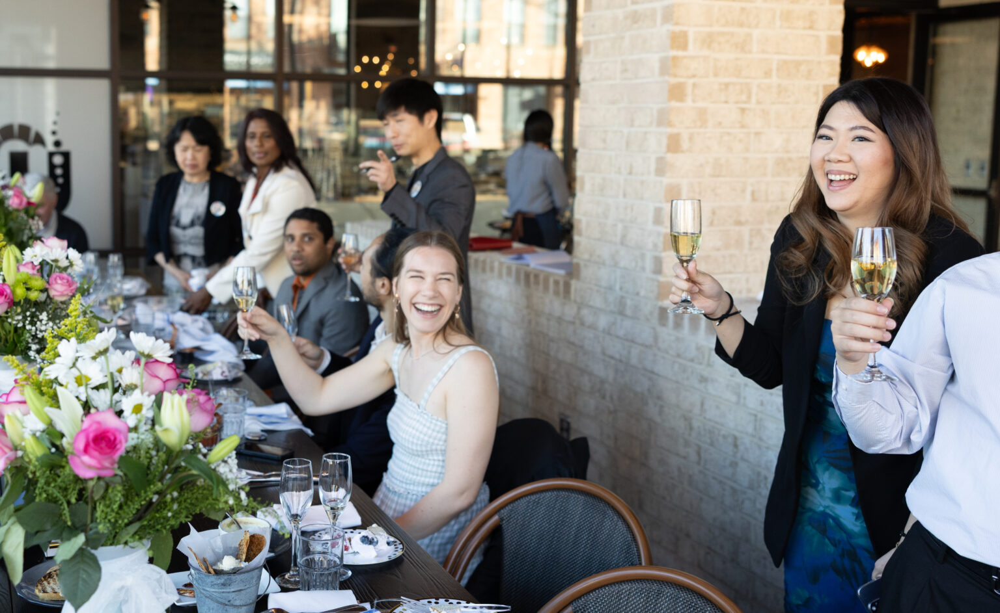

Hello Future Me,

One of your childhood friends from elementary school just tied the knot.

Every time you find yourself at a wedding you can’t just help but suspend your thoughts on life and just be present. To be present with overwhelming joy – joy for both the bride and groom.

What a privilege it was – to witness such a beautiful start of their next chapter in life 🙂

I wonder if you’ll ever find someone in the near future lol

From,

Present Me

