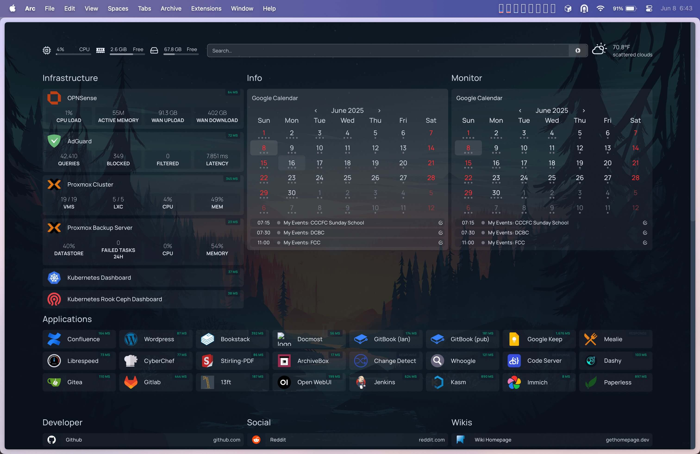

Homelab Series:

- [Homelab #1 - Humble Beginnings](/tinkering/2024-08-26/)
- [Homelab #2 - Proxmox Cluster](/tinkering/2025-06-04/)
- [Homelab #3 - Kubernetes Cluster (Initial Setup)](/tinkering/2025-06-05/)
- [Homelab #4 - Kubernetes Cluster (Infrastructure Setup)](/tinkering/2025-06-06/)
- [Homelab #5 - Kubernetes Cluster (App Bonanza!!!!!!)](/tinkering/2025-06-08/)

# Kubernetes Cluster (App Bonanza!!!!!!)

Here's a screenshot of my dashboard displaying most of my 50 plus servers :D

It's still a work in progress.

[](assets/1.jpeg)

# What Apps am I Running?

Here are some of the apps I'm running on Kubernetes:
- 13ft - bypass website paywalls
- code-server - VC Code inside web browser
- dashy - a dashboard for homelabs
- k8s-dashboard - a dashboard for the Kubernetes cluster
- librespeed - an internet speeed test
- open-webui - an opensource "ChatGPT" web interface
- stirling-pdf - a PDF manipulator within browser
- changedetection - monitors website changes
- cyberchef - a SWE toolbox for data manipulation
- homepage - a dashboard for homelabs
- k8s-metrics-service - i forgot
- mealie - a recipe manager
- sockpuppetbrowser - an internal tool for changedetection
- whoogle - a privacy-respecting Google

# Example App Installation

Here we will install the homepage app as an example for most of the applications I'm running.

In this case, we will be creating 4 Kubernetes workloads:
1. **homepage-pvc.yml** - this allocates PersistentVolumeClaims for persistent storage the homepage will be using
2. **homepage-deployment.yml** - this defines the Deployment details needed to download and run the homepage container
3. **homepage-svc.yml** - this defines the Service that will act as the gateway to the running homepage container
4. **homepage-ingress.yml** - this will auto issue an SSL certificate

### 1. PersistentVolumeClaim

Create a file with the following contents

```yaml # homepage-pvc.yml
kind: PersistentVolumeClaim
metadata:
  name: cephfs-homepage
spec:
  accessModes:
  - ReadWriteMany
  resources:
    requests:
      storage: 1Gi
  storageClassName: rook-ceph-fs
---
apiVersion: v1
kind: PersistentVolumeClaim
metadata:
  name: cephfs-homepage-public
spec:
  accessModes:
  - ReadWriteMany
  resources:
    requests:
      storage: 1Gi
  storageClassName: rook-ceph-fs
 ```

Then apply it

```shell
kubectl apply -f homepage-pvc.yml
```

### 2. Deployment

Create a file with the following contents

```yaml # homepage-deployment.yml
apiVersion: apps/v1
kind: Deployment
metadata:
  name: homepage
spec:
  replicas: 2
  selector:
    matchLabels:
      app: homepage
  template:
    metadata:
      labels:
        app: homepage
    spec:
      automountServiceAccountToken: true
      dnsPolicy: ClusterFirst
      enableServiceLinks: true
      containers:
      - name: homepage
        image: ghcr.io/gethomepage/homepage:latest
        ports:
        - containerPort: 3000
        env:
        - name: HOMEPAGE_ALLOWED_HOSTS
          value: "homepage.lan"
        volumeMounts:
        - mountPath: /app/config
          name: cephfs-homepage
        - mountPath: /app/public/images
          name: cephfs-homepage-public
      volumes:
      - name: cephfs-homepage
        persistentVolumeClaim:
          claimName: cephfs-homepage
          readOnly: false
      - name: cephfs-homepage-public
        persistentVolumeClaim:
          claimName: cephfs-homepage-public
          readOnly: false
```

Then apply it

```shell
kubectl apply -f homepage-deployment.yml
```

### 3. Service

Create a file with the following contents

```yaml # homepage-svc.yml
apiVersion: v1
kind: Service
metadata:
  name: homepage
spec:
  ports:
  - port: 80
    targetPort: 3000
  selector:
    app: homepage
  type: LoadBalancer
```

Then apply it

```shell
kubectl apply -f homepage-svc.yml
```

### 4. Ingress

Create a file with the following contents

```yaml # homepage-ingress.yml
apiVersion: networking.k8s.io/v1
kind: Ingress
metadata:
  name: homepage
  annotations:
    cert-manager.io/cluster-issuer: "letsencrypt-prod"
    nginx.ingress.kubernetes.io/rewrite-target: /
spec:
  ingressClassName: nginx
  tls:
  - hosts:
    - homepage.lan
    secretName: tls-homepage
  rules:
  - host: homepage.lan
    http:
      paths:
      - path: /
        pathType: Prefix
        backend:
          service:
            name: homepage
            port:
              number: 80
 ```

Then apply it

```shell
kubectl apply -f homepage-ingress.yml
```

# Repeat

The example above is pretty much the template I've used for deploying the rest of the applications.

Of course, some may not use PersistentVolumeClaims and other may not use Ingress. So create and apply those manifest files accordingly.
